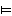

# Unit materials

This page will be updated as term progresses.

_Files linked to on this page will require you to log in with your university username and password. Just click the link and you will be redirected to a login page, please check it starts with `login.microsoftonline.com`. Never, ever enter your university password on a site without checking first whether it is the real login page or a fake one trying to steal your account (and your maintenance loan) - the real one starts with the address mentioned and your browser must not give any kind of security warning when you are on the page._

**Links will only start working when student registration for next year goes live, probably around the start of welcome week.**

This link to the [unit filestore](https://uob.sharepoint.com/:b:/r/teams/UnitTeams-COMS10014-2022-23-TB-1-A/Class%20Materials/) gives you a folder view of where all the videos, worksheets and notes are stored.

## Week 1, Workshop 1 on Monday, 26 September

  - Topic: Logic 1
    - Introduction
    - First-order logic (also called predicate logic)
    - Propositions
    - Logical operations: and, or, not, xor, if, iff
    - Terminology: converse, inverse, contrapositive
    - Syntax of first-order logic
  - Video: [Logic 1 (37 minutes)](https://uob.sharepoint.com/:v:/r/teams/UnitTeams-COMS10014-2022-23-TB-1-A/Shared%20Documents/Videos/logic-1-full-recording.mp4)
  - Worksheet: [WS1](https://uob.sharepoint.com/:b:/r/teams/UnitTeams-COMS10014-2022-23-TB-1-A/Class%20Materials/worksheets/WS1.pdf)
  - Solutions: _will appear after the workshop_

Please watch the video and then read any notes before coming to the workshop. You can look at the worksheet before if you want to, but you do not have to - you will be working on it in the workshop.

## Week 1, Workshop 2 on Thursday, 29 September

  - Topic: Logic 2
    - Truth tables
    - Semantics of first-order logic
    - Terminology: valid/tautology, satisfiable/consistent, contradiction, contingency
    - Logical equivalence
    - Laws of logic
    - Normal forms
    - Functional completeness
  - Videos:
    - [Compound Propositions (20 min)](https://uob.sharepoint.com/:v:/r/teams/UnitTeams-COMS10014-2022-23-TB-1-A/Shared%20Documents/Videos/logic-2_1-11_Compound_Propositions.mp4)
    - [Validity and Satisfiability (7 min)](https://uob.sharepoint.com/:v:/r/teams/UnitTeams-COMS10014-2022-23-TB-1-A/Shared%20Documents/Videos/logic-2_12-18_Validity_and_Satisfiability.mp4)
    - [Logical Equivalence (11 min)](https://uob.sharepoint.com/:v:/r/teams/UnitTeams-COMS10014-2022-23-TB-1-A/Shared%20Documents/Videos/logic-2_19-23_Logical_Equivalence.mp4)
    - [Normal Forms and Functional Completeness (16 min)](https://uob.sharepoint.com/:v:/r/teams/UnitTeams-COMS10014-2022-23-TB-1-A/Shared%20Documents/Videos/logic-2_24-end_Normal_Forms_and_Functional_Completeness.mp4)
  - Worksheet: [WS2](https://uob.sharepoint.com/:b:/r/teams/UnitTeams-COMS10014-2022-23-TB-1-A/Class%20Materials/worksheets/WS2.pdf)
  - Solutions: _will appear after the workshop_

## Week 2, Workshop 1 on Monday, 3 October

  - Topic: Proof 1
    - What is a proof?
    - Formal reasoning
    - Axiom schemas
    - Modus Ponens
    - Entailment ()
    - Theorems
  - Videos:
    - [Introduction to proof (18 min)](https://uob.sharepoint.com/:v:/r/teams/UnitTeams-COMS10014-2022-23-TB-1-A/Shared%20Documents/Videos/proof-1-introduction-to-proof-narrated_v3.mp4)
    - [Formal reasoning (24 min)](https://uob.sharepoint.com/:v:/r/teams/UnitTeams-COMS10014-2022-23-TB-1-A/Shared%20Documents/Videos/proof-1-formal-reasoning-narrated_v3.mp4)
  - Worksheet: Class Test 1 (will be handed out in the workshop)

To get attendance for this workshop, you must complete the class test and hand in your completed answer sheet before the end of the workshop.

Class Test 1 is only on logic material from Week 1, not on the proof material from this week yet.

## Week 3, Workshop 2 on Thursday, 6 October

  - Topic: Proof 2
    - Proof by induction
    - Application to loop invariants
  - Videos:
    - [Mathematical induction (26min)](https://uob.sharepoint.com/:v:/r/teams/UnitTeams-COMS10014-2022-23-TB-1-A/Shared%20Documents/Videos/proof-2-mathematical-induction-narrated-HR_v3.mp4)
    - [Loop invariants (28min)](https://uob.sharepoint.com/:v:/r/teams/UnitTeams-COMS10014-2022-23-TB-1-A/Shared%20Documents/Videos/proof-2-loop-invariant-proof-narrated_v3.mp4)
  - Worksheet: [WS4](https://uob.sharepoint.com/:b:/r/teams/UnitTeams-COMS10014-2022-23-TB-1-A/Class%20Materials/worksheets/WS1.pdf)
  - Solutions: _will appear after the workshop_

## Week 4, Workshop 1 on Monday, 10 October

  - Topic: Proof 3
    - Direct proof
    - Indirect proof
    - Proof by contradiction
    - Writing up proofs
  - Videos:
    - [Proof strategies (49 min)](https://uob.sharepoint.com/:v:/r/teams/UnitTeams-COMS10014-2022-23-TB-1-A/Shared%20Documents/Videos/proof-3-proof-strategies-narrated_v8.mp4)
  - Worksheet: [WS5](https://uob.sharepoint.com/:b:/r/teams/UnitTeams-COMS10014-2022-23-TB-1-A/Class%20Materials/worksheets/WS5.pdf)
  - Solutions: _will appear after the workshop_