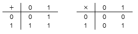
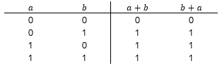
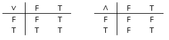
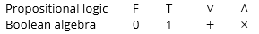

# Numbers and logic

Think of the usual integers \\(\{\ldots,-3,-2,-1,0,1,2,3,\ldots}\\) and the operations \\(+\\),\\(-\\), and \\(\times\\). This is a 'structure' in which we can do mathematics, and you should be familiar with it as well as some other structures such as the rational or real numbers. This structure has many rules that you know, such as that \\(x+0=x\\) and \\(a+b=b+a\\) and \\(a \times (b+c)=a \times b+a \times c\\) and so on for any numbers \\(a,b,c\\).
Boolean algebra is a new structure where there are, to begin with, only two numbers: 0 and 1. The basic operations are \\(+\\) and \\(\times\\) and we can give their addition and multiplication tables:

The main difference from usual arithmetic is that 1+1 is now 1 again - not 2, because that does not exist, and also not 0 (that would also be an interesting structure, but it is a different one).
In this structure, we still have some of the usual rules, and a lot of new rules, and because there are only two numbers we can check them by writing out all possibilities. For example, is it still true that \\(a+b=b+a\\) for any \\(a,b\\)? Let's try it out:

Assuming that a+b is the value in the a row and b column, and that b+a is the value in the b row and a column of the addition table, we can see that a+b and b+a are the same for all possible numbers in this structure.

Propositional logic, also called first-order logic, is many things, but among others it is yet another mathematical structure. The 'numbers' here are the two truth values T (true) and F (false), and instead of adding and multiplying, the two basic operations are \\(\wedge\\) pronounced 'AND' and \\(\vee\\) pronounced 'OR' with the following operation tables:

For example, \\(T \wedge F = F \\) as the element in the T row and F column of the \\(\wedge\\) table is F.

You have probably noticed the obvious point: Boolean algebra and propositional logic are the same thing, just with different symbols - a mathematician would say the two structures are isomorphic, a Greek word that roughly translates as "same shape":

