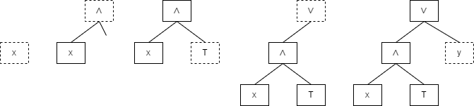
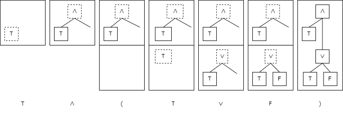

# Parsing terms

How do you parse a term? The full answer is in your second-year unit COMS20007 Programming Languages and Computation, but here is a sketch for now.

First, a simplified example that ignores precedence - let's say we want to parse a string like \\(x \wedge T \vee y\\) into a term in propositional logic, ignoring precedence.

The algorithm goes something like this:

You read 'tokens' (values, variables or operators) one at a time from left to right and build a tree according to these rules.

  1. If you have no tree yet:
     1. If you see a value or variable, make a tree with one node.
     2. If you see a negation, make a tree with one negation node and one dangling edge.
     3. If you see a \\(\wedge\\) or \\(\vee\\) operator, parsing fails (a string for a valid term cannot start with one of these).
  2. If you have a tree, and no dangling edge:
     1. If you see a value or variable, parsing fails (this means there were two values/variables in a row).
     2. If you see a negation, parsing fails (a negation cannot appear immediately _after_ a value).
     3. If you see a \\(\wedge\\) or \\(\vee\\) operator, make a new node for it, connect its left child to the root of the tree you have so far, and make its right edge dangling.
  3. If you have a dangling edge:
     1. If you see a value or a variable, add a node for it on the dangling edge.
     2. If you see a negation, add a node for it on the dangling edge; the negation node now has a new dangling edge itself.
     3. If you see a \\(\wedge\\) or \\(\vee\\) operator, parsing fails (this means there were two operators in a row).

With only a little extra work, we can parse bracketed terms, whether the brackets are necessary or not.

  4. If you see an opening bracket, put your current tree to one side, and start parsing a new tree. This means you now have at least two trees 'in progress'.
  5. If you see a closing bracket and you have more than one tree in progress, take the last tree, and try and connect its root to the previous tree as if it were a value node.
  6. If you see a closing bracket when there is only one tree in progress, or you finish parsing and there is stillmore than one tree in progress, then parsing fails (due to mismatched brackets).

For example on the string \\(T \wedge (T \vee F)\\):

But, we don't yet have a parser that can correctly parse \\(T \vee F \wedge F\\) as \\(T \vee (F \wedge F)\\) using the precedence rules. We will come back to this point.
