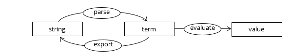

# Terminology, or: what is a term?

Mathematics in schools has gone through many waves of fashion. In one of these waves, children were taught the difference between a number and a numeral - a number is an 'abstract mathematical concept' and a numeral is a way of representing such a number on paper. For example, 'four' and '4' are numerals that represent some abstract concept of 'fourness' that could, for example, be applied to a plate of four apples or a table with four children sitting around it. Teaching this to schoolchildren sounds like a recipe for unnecessary confusion to me, and we can ignore the distinction between numbers and numerals in this unit too. 

We cannot ignore a similar problem when we are defining terms, like `2+2` or `1-x`. The exact same problem and solutions happen for terms over the usual integers or real numbers, in Boolean algebra and in propositional logic.

The problem is: how do we parse \\(2+3 \times 5\\) so it evaluates to 17 and not 25, following BODMAS (or any other name you may have learnt at school for this rule)? There is of course a rule like this for propositional logic too. This is important for Computer Scientists as we might at some point be designing our own programming language, or a better parser, interpreter or compiler for an existing language, and we still want expressions like this to come out correctly.

To solve the problem, we first have to be really pedantic like in the number/numeral distinction: a _term_ is an abstract mathematical concept, and `2+2` and the like are _representations_ of terms in one particular format – we will see soon that there are other formats. 

Or to be both pedantic and useful to computer scientists: _a term is an abstract, structured mathematical concept that we can implement in various ways in different programming languages._ `2+2` and the like are _strings_ that represent terms in particular formats. Turning a string into a term is called _parsing_, turning a term back into a string could be called rendering or _exporting_. You can also evaluate a term to produce a value such as a number (or numeral, if you're pedantic about that too):

Along the way we also want our parser to be able to decide if a string is a valid representation of a term or not, for example `(2+2)` is valid, but `8-)` is not.

What this gets us is that we can see that the problem is not one of terms itself, but of parsing strings into terms. Once the term is parsed, any ambiguity is gone. Actually, it is only a problem in one particular representation of terms, there are other representations where the problem simply goes away.
