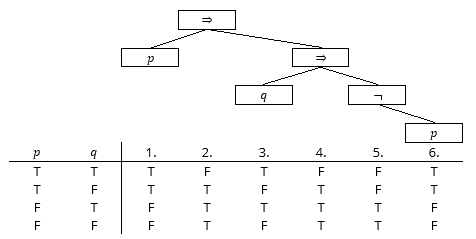

# Terms are trees

We can look at how to represent terms in different programming languages later on, but for now we have a way of drawing terms themselves - not just representations - using trees:

Some maths teachers stress the difference between subtraction such as \\(2-3\\) and negation of a value such as \\((-2)\\). For example, \\(3+(-2)\\) is not a subtraction, it is an addition, and one of its summands is a negated value. And indeed, as trees, there is a difference: a subtraction node has two children, a negation node only one:

## Formal definition of terms

Let us formally define what is or is not a term, _independently_ of a particular representation as strings. A term of integers is a tree structure containing nodes, some of which may have children, that can be built from the following rules:

  1. A node containing an integer (with no children) is a term.
  2. If X is a term, then a negation node with one child X is a term.
  3. If X and Y are terms, then an addition, subtraction or multiplication node with the two children X and Y is a term.

This is called a recursive definition, as some of the terms are defined using other terms. This is one of the mathematical tricks so a finite number of rules - 3 in this case - can cover an infinite number of different possible terms. Note that there is no such thing as a 'bracket term', because the tree structure makes clear what is meant already.

When something is defined by recursion, usually you want to operate on it by recursion too. You will learn lots of this in your programming units, but for now, let’s look at the obvious thing to do with a term: evaluate it. 

  1. To evaluate a node containing an integer, just take that integer.
  2. To evaluate a negation node, first evaluate its child, then negate that integer.
  3. To evaluate an addition (resp. subtraction, multiplication) term, first evaluate both children, then add (resp. subtract, multiply) the integers you get.

The recursion here happens whenever we say "first evaluate" inside the description of how to evaluate a term. You can turn this description into Haskell code almost literally - that is the kind of thing Haskell is designed for - and into Java code with a bit more patience.

For another example, let us define how to compute the depth of a tree:

  1. The depth of a node containing an integer is 1.
  2. To compute the depth of a negation node, first compute the depth of its child, then add 1.
  3. To compute the depth of an addition, subtraction or multiplication node, first compute the depths x and y of both children. Take the maximum of x and y, then add 1.

As an exercise, you could write out the same definition of terms, evaluation and depth for propositional logic - this is mostly done in the lectures for you already so you can compare your solutions to it. (Depth works exactly the same whatever type of tree you have.)

_Note: if you allow division nodes in a term too, then evaluation can fail. You can extend the rules to say that evaluation fails if (a) you are evaluating a division node and the second child evaluates to 0, or (b) if evaluating any of the term's children fails. Luckily, there is no division in propositional logic so its evaluation cannot fail._

## Variables

What about terms with variables such as \\(2 + x\\)? Defining them is easy enough, we just add a new rule similar to the one for integers:

> 4. A node containing a variable is a term.

Computing the depth is not hard:

> 4. The depth of a node containing a variable is 1.

But you cannot evaluate a term with variables directly. Instead, you now have to evaluate terms _in an environment_, where an environment is a table mapping variables to values. By convention, environments are written with the letter \\(\Gamma\\), which is the Greek capital letter Gamma.

For example, the evaluation of \\(2+x\\) in the environment \\(\Gamma = \{x=1, y=2\}\\) is 3. The evaluation of \\(3 - z\\) in the same environment is undefined, however.

The full evaluation rules with variables are:

  1. To evaluate a node containing an integer in an environment \\(\Gamma\\), just take that integer.
  2. To evaluate a negation node in an environment \\(\Gamma\\), first evaluate its child, then negate that integer. If evaluating the child fails, then evaluating this node fails too.
  3. To evaluate an addition (resp. subtraction, multiplication) term in an environment \\(\Gamma\\), first evaluate both children, then add (resp. subtract, multiply) the integers you get. If evaluating any child fails, then evaluating this node fails too.
  4. To evaluate a node containing a variable in an environment \\(\Gamma\\), if the variable is defined in \\(\Gamma\\) then take that value. Otherwise, the evaluation fails.

The exact same principle applies to logic, with 'integer' replaced by 'truth value' everywhere, and addition, subtraction, and multiplication replaced by logical and, or, not and the other logical operations.

## Truth Tables

In Maths A, the immediate application of this theory is a formal way to create a truth table for a compound proposition, formal enough that we could program a computer to do it. Let's say we want to create the truth table for \\(p \Rightarrow (q \Rightarrow \neg p)\\):

First, we parse the proposition into a tree. Then we evaluate recursively:

  - The top-level operator (2.) depends on (1.) and (4.), so we need to evaluate those first.
  - (1.) is the variable p, so we can copy the truth values from the p column on the left to the (1.) column.
  - (4.) is another implication operator, so we need to evaluate (3.) and (5.) first.
  - (3.) is the variable q, so we can copy the q column.
  - (5.) is a negation operator, so we need to evaluate (6.) first.
  - (6.) is the variable p, so we copy the p column again.
  - This lets us evaluate (5.) by taking the (6.) column and negating all values.
  - This lets us evaluate (4.) by performing the logical implication on columns (3.) and (5.) that we have now filled in.
  - This lets us evaluate (2.) by performing the logical implication on columns (1.) and (4.) that we have now filled in.

In the notation that we just introduced above, in each row, the assignments to the variables p, q are an environment \\(\Gamma\\).
